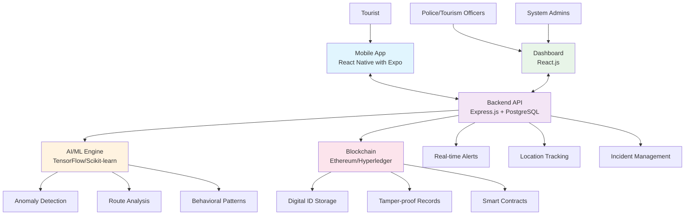

# 🛡️ Suraksha Yatra - Smart Tourist Safety Monitoring System

<div align="center">
  
  <h3>🎯 Keeping Tourists Safe with Tech Magic! ✨</h3>
  
</div>

## 📋 Project Overview

**Suraksha Yatra** is our super cool 😎 Smart Tourist Safety Monitoring & Incident Response System built for SIH 2025! Think of it as a digital superhero 🦸‍♂️ that watches over tourists 24/7 using the awesome power of Blockchain, AI, and Mobile tech! 


We're basically creating a **digital safety net** for travelers - because nobody should have to worry about safety when they're busy making memories! 📸✨

### 🎯 Problem Statement
- **Ministry**: Development of North Eastern Region / Tourism / Home Affairs
- **Category**: Software (Travel & Tourism Safety)  
- **Problem ID**: SIH25-PS-25002

<div align="center">
  
  <p><em>"With great code comes great responsibility!" 🕷️</em></p>
</div>

### 🌟 Key Features (aka Our Superpowers!)
- 🆔 **Blockchain-based Digital Tourist ID** *(Tamper-proof like a superhero suit!)*
- 📱 **Mobile App with Panic Button & Geo-fencing** *(Your pocket guardian angel)*
- 🤖 **AI-powered Anomaly Detection** *(Sherlock Holmes meets Iron Man)*
- 🚨 **Real-time Police/Tourism Dashboard** *(Mission Control for safety heroes)*
- 📍 **Location-based Safety Monitoring** *(GPS with superpowers)*
- 👨‍👩‍👧‍👦 **Family Location Sharing** *(Peace of mind for loved ones)*

<div align="center">
  
</div>

---

## 🏗️ System Architecture



---

## 🛠️ Technology Stack (Our Arsenal of Awesomeness!)

<div align="center">
  
  <p><em>Assembling the Tech Avengers! 🦸‍♀️🦸‍♂️</em></p>
</div>

### 📱 Frontend (Mobile App) - *The Hero in Your Pocket*
- **Framework**: React Native with Expo 🚀 *(Because native is the way!)*
- **Platform**: Android & iOS 📱 *(Double the fun!)*
- **Key Libraries**: 
  - React Navigation 🧭 *(Your app's GPS)*
  - React Native Maps 🗺️ *(See the world!)*
  - AsyncStorage 💾 *(Memory like an elephant)*
  - React Native Geolocation 📍 *(Where are you?)*

### 🖥️ Frontend (Dashboard) - *Command Center Vibes*
- **Framework**: React.js ⚛️ *(The reliable sidekick)*
- **UI Library**: Material-UI / Ant Design 🎨 *(Making it pretty!)*
- **Maps**: Google Maps API / Mapbox 🌍 *(See everything!)*
- **State Management**: Redux Toolkit 🔄 *(Keeping things organized)*


### ⚙️ Backend - *The Brain Behind the Operation*
- **Framework**: Express.js 🚂 *(Fast and furious)*
- **Database**: PostgreSQL 🐘 *(Never forgets anything)*
- **Authentication**: JWT + OAuth2.0 🔐 *(Fort Knox security)*
- **Real-time**: Socket.io ⚡ *(Faster than The Flash)*
- **API Documentation**: Swagger 📚 *(Documentation that doesn't suck)*

### 🤖 AI/ML - *The Smart Cookie*
- **Framework**: TensorFlow / Scikit-learn 🧠 *(Einstein's digital cousin)*
- **Language**: Python 🐍 *(Sssssuper smart)*
- **Features**: 
  - Anomaly Detection 🕵️ *(Sherlock Holmes mode)*
  - Route Deviation Analysis 🛣️ *(GPS with attitude)*
  - Behavioral Pattern Recognition 👁️ *(Mind reader activated)*

### ⛓️ Blockchain - *The Trustworthy Friend*
- **Platform**: Ethereum (Testnet) / Hyperledger Fabric ⛓️ *(Unbreakable chains)*
- **Smart Contracts**: Solidity 📜 *(Smart as Hermione)*
- **Integration**: Web3.js 🌐 *(Bridging worlds)*
- **Purpose**: Digital ID & Tamper-proof Records 🛡️ *(Bulletproof storage)*

---

## 🚀 Getting Started (Let's Build Something Amazing!)

<div align="center">
  
  <p><em>Ready to code like a rockstar? 🎸</em></p>
</div>

### Prerequisites (What You Need in Your Toolkit 🧰)
- Node.js (v16+) 📦 *(The package master)*
- Python (v3.8+) 🐍 *(The snake charmer)*
- PostgreSQL 🐘 *(The memory elephant)*
- Expo CLI 📱 *(Mobile magic wand)*
- Git 🌿 *(Version control ninja)*

### 📦 Installation (The Fun Begins!)


1. **Clone the Repository** 📂
   ```bash
   git clone https://github.com/ankita1477/Suraksha-Yatra-SIH25.git
   cd Suraksha-Yatra-SIH25
   ```
   *🎉 Congratulations! You've got the code!*

2. **Setup Backend** ⚙️
   ```bash
   cd backend
   npm install
   cp .env.example .env
   # Configure your database and API keys in .env
   npm run dev
   ```
   *🚀 Backend is ready to rock!*

3. **Setup Mobile App** 📱
   ```bash
   cd mobile-app
   npm install
   expo start
   ```
   *📱 Your mobile app is coming to life!*

4. **Setup Dashboard** 🖥️
   ```bash
   cd dashboard
   npm install
   npm start
   ```
   *💻 Dashboard deployed like a boss!*

5. **Setup AI/ML Engine** 🤖
   ```bash
   cd ai-engine
   pip install -r requirements.txt
   python app.py
   ```
   *🧠 AI is now online and thinking!*

<div align="center">
  
  <p><em>You did it! Everything is up and running! 🎊</em></p>
</div>

---

## 📁 Project Structure

```
Suraksha-Yatra-SIH25/
│
├── 📱 mobile-app/              # React Native Expo App
│   ├── src/
│   │   ├── components/
│   │   ├── screens/
│   │   ├── services/
│   │   └── utils/
│   ├── App.js
│   └── package.json
│
├── 🖥️ dashboard/               # React.js Dashboard
│   ├── src/
│   │   ├── components/
│   │   ├── pages/
│   │   ├── services/
│   │   └── utils/
│   ├── public/
│   └── package.json
│
├── ⚙️ backend/                 # Express.js API
│   ├── src/
│   │   ├── controllers/
│   │   ├── models/
│   │   ├── routes/
│   │   ├── middleware/
│   │   └── services/
│   ├── server.js
│   └── package.json
│
├── 🤖 ai-engine/              # AI/ML Services
│   ├── models/
│   ├── services/
│   ├── utils/
│   ├── app.py
│   └── requirements.txt
│
├── ⛓️ blockchain/              # Smart Contracts
│   ├── contracts/
│   ├── migrations/
│   ├── test/
│   └── truffle-config.js
│
├── 📚 docs/                   # Documentation
├── 🧪 tests/                  # Test files
└── 📋 README.md
```

---

## 🎯 MVP Features Implementation (Our 12-Week Adventure!)

<div align="center">
  
  <p><em>Let's build this thing step by step! 🏗️</em></p>
</div>

### Phase 1: Core Setup (Week 1-2) 🏁 *"The Foundation Builders"*
- [ ] Project structure setup 📁 *(Organizing like Marie Kondo)*
- [ ] Basic React Native app with navigation 📱 *(Baby steps!)*
- [ ] Express.js backend with PostgreSQL 🗄️ *(Building the backbone)*
- [ ] Basic authentication system 🔐 *(Who goes there?)*
- [ ] GitHub repository setup 🌿 *(Version control activated)*


### Phase 2: Digital ID & Authentication (Week 3-4) 🆔 *"Identity Crisis Solved"*
- [ ] Blockchain integration for Digital ID ⛓️ *(Creating digital DNA)*
- [ ] User registration and login 👤 *(Welcome aboard!)*
- [ ] KYC integration 📄 *(Know your customer, literally)*
- [ ] Smart contract development 📜 *(Digital contracts that are actually smart)*

### Phase 3: Location & Safety Features (Week 5-6) 📍 *"The Guardian Angels"*
- [ ] GPS tracking implementation 🛰️ *(Satellite surveillance activated)*
- [ ] Geo-fencing system 🚧 *(Virtual boundaries that actually work)*
- [ ] Panic button functionality 🚨 *(The big red button of safety)*
- [ ] Real-time location sharing 📡 *(Share the adventure!)*

### Phase 4: AI/ML Integration (Week 7-8) 🤖 *"The Brain Surgeons"*
- [ ] Anomaly detection algorithms 🕵️ *(Sherlock Holmes 2.0)*
- [ ] Route deviation detection 🛣️ *(When GPS gets confused)*
- [ ] Inactivity monitoring ⏰ *(Are you still there?)*
- [ ] Behavioral pattern analysis 📊 *(Understanding human nature)*

### Phase 5: Dashboard & Monitoring (Week 9-10) 📊 *"Mission Control"*
- [ ] Police/Tourism dashboard 🖥️ *(Command center vibes)*
- [ ] Real-time alerts system 🚨 *(Faster than the speed of light)*
- [ ] Incident management 📋 *(Keeping track of everything)*
- [ ] Reporting and analytics 📈 *(Data that tells stories)*

### Phase 6: Testing & Deployment (Week 11-12) 🚀 *"The Final Countdown"*
- [ ] Comprehensive testing 🧪 *(Breaking things before users do)*
- [ ] Performance optimization ⚡ *(Making it lightning fast)*
- [ ] Security audit 🔒 *(Fort Knox level security)*
- [ ] Deployment and documentation 📚 *(Launch time!)*

<div align="center">
  
  <p><em>12 weeks later... WE DID IT! 🎉</em></p>
</div>

---

## 🔧 Development Guidelines

### 🎨 Code Standards
- Use ESLint and Prettier for JavaScript/TypeScript
- Follow PEP 8 for Python code
- Use meaningful commit messages
- Write comprehensive documentation

### 🧪 Testing
- Unit tests for all components
- Integration tests for APIs
- End-to-end testing for critical flows
- Load testing for performance validation

### 🔒 Security
- AES-256 encryption for data
- OAuth2.0 for authentication
- Input validation and sanitization
- Regular security audits

---

## 👥 Team Collaboration (Working Together Like Avengers!)

<div align="center">
  
  <p><em>Teamwork makes the dream work! 💪</em></p>
</div>

### 📋 Task Management *(Organizing Chaos Like a Pro)*
- Use GitHub Issues for task tracking 📝 *(Todo lists that don't get lost)*
- Create branches for each feature 🌿 *(Parallel universe coding)*
- Pull request reviews mandatory 👀 *(No code goes unnoticed)*
- Daily standup meetings ☕ *(Coffee + Updates = Perfect combo)*

### 📚 Documentation *(Making Future You Happy)*
- API documentation with Swagger 📖 *(Self-documenting awesomeness)*
- Code comments for complex logic 💭 *(Explaining the magic tricks)*
- README files for each module 📄 *(Breadcrumbs for developers)*
- Architecture decision records (ADRs) 🏗️ *(Why we chose what we chose)*


---

## 🚀 Deployment (Taking Over the World!)

<div align="center">
  
  <p><em>Ready for world domination? 🌍</em></p>
</div>

### 🌐 Production Environment *(The Big Leagues)*
- **Backend**: AWS EC2 / DigitalOcean ☁️ *(Cloud nine hosting)*
- **Database**: AWS RDS PostgreSQL 🗄️ *(Elephant in the cloud)*
- **Mobile**: Play Store / App Store 📱 *(Global reach activated)*
- **Dashboard**: Netlify / Vercel 🌐 *(Lightning fast deployment)*
- **Blockchain**: Ethereum Mainnet / Private Network ⛓️ *(Decentralized awesomeness)*

---

## 📞 Contact & Support (We're Here to Help!)

<div align="center">
  
</div>

### 👨‍💻👩‍💻 Meet Our Amazing Team! (The Dream Squad!)

<div align="center">
  
  <p><em>Six minds, one mission! 🚀</em></p>
</div>

| 🦸‍♀️🦸‍♂️ **Team Member** | 🎯 **Role** | 💫 **Superpower** |
|---|---|---|
| **Ankita Rahi** 👑 | Team Lead & Full Stack Developer | *Making impossible possible* |
| **Anchal Kumari** 💻 | Frontend Specialist | *UI/UX Magic* |
| **Juhi Rani** 📱 | Mobile App Developer | *React Native Ninja* |
| **Saswat Ranjan Behera** 🤖 | AI/ML Engineer | *Algorithm Wizard* |
| **Anwesha Mishra** ⛓️ | Blockchain Developer | *Decentralization Expert* |
| **Sahil Behera** 🗄️ | Backend & DevOps | *Server Superhero* |

<div align="center">
  
  <p><em>Together we code, together we conquer! 💪</em></p>
</div>

### 📬 Get in Touch
- **Team Lead**: Ankita Rahi 👑 *(The mastermind)*
- **Email**: [team.surakshayatra@example.com] 📧 *(Slide into our inbox)*
- **GitHub**: [https://github.com/ankita1477/Suraksha-Yatra-SIH25](https://github.com/ankita1477/Suraksha-Yatra-SIH25) 🌿 *(Where the magic happens)*

---

## 📄 License

This project is licensed under the MIT License - see the [LICENSE](LICENSE) file for details.

*Translation: Use it, share it, love it! 💕*

---

## 🙏 Acknowledgments (Our Heroes!)

<div align="center">
  
</div>

- Smart India Hackathon 2025 🏆 *(The stage for our brilliance)*
- Ministry of Development of North Eastern Region 🏛️ *(Our awesome sponsors)*
- Ministry of Tourism 🗺️ *(Making travel safer)*
- Ministry of Home Affairs 🏠 *(Keeping everyone secure)*

---

<div align="center">
  
  
  **Happy Coding! 🚀**
  
  *Building safer tourism experiences with technology... and a lot of coffee! ☕*
  
  
</div>
