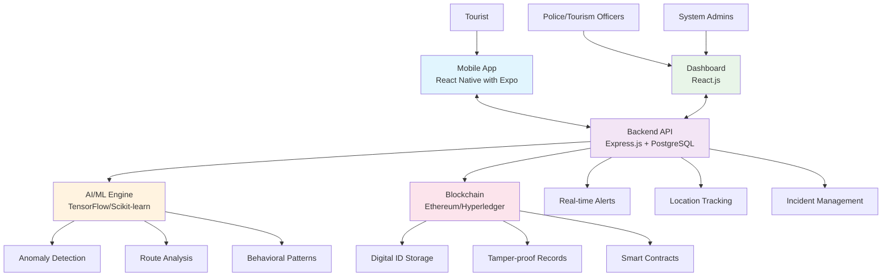

# 🛡️ Suraksha Yatra - Smart Tourist Safety Monitoring System

<div align="center">
  
  <h3>🎯 Keeping Tourists Safe with Tech Magic! ✨</h3>
  
</div>

## ### � **Day 5: Integration & Testing** (Everything Comes Together!)
**Focus**: System Integration + Quality Assurance

**💻 Development Tasks**:
- [ ] End-to-end testing of complete system
- [ ] Security hardening + API optimization
- [ ] Mobile app final testing + demo scenarios
- [ ] Dashboard final testing + cross-browser compatibility
- [ ] Bug fixes + performance optimization
- [ ] Mobile ↔ Backend ↔ Dashboard complete flow testing
- [ ] Prepare live demo environment

**📊 Documentation Tasks**:
- [ ] Presentation rehearsal + timing optimization
- [ ] Final Q&A preparation + judge interaction practice
- [ ] Demo support documentation + troubleshooting guide

**Suraksha Yatra** is our super cool 😎 Smart Tourist Safety Monitoring & Incident Response System built for SIH 2025! Think of it as a digital superhero 🦸‍♂️ that watches over tourists 24/7 using the awesome power of Blockchain, AI, and Mobile tech! 


We're basically creating a **digital safety net** for travelers - because nobody should have to worry about safety when they're busy making memories! 📸✨

## 📚 Table of Contents

<div align="center">
  
  <p><em>Navigate like a pro! 🧭</em></p>
</div>

### 🎯 **Quick Navigation**
| Section | Description | Jump To |
|---------|-------------|---------|
| 🎯 **Problem Statement** | SIH 2025 details and objectives | [View](#🎯-problem-statement) |
| 🌟 **Key Features** | Our superpowers and capabilities | [View](#🌟-key-features-aka-our-superpowers) |
| 🏗️ **System Architecture** | Technical system design | [View](#🏗️-system-architecture) |
| 🛠️ **Technology Stack** | Our arsenal of technologies | [View](#🛠️-technology-stack-our-arsenal-of-awesomeness) |
| 🚀 **Getting Started** | Installation and setup guide | [View](#🚀-getting-started-lets-build-something-amazing) |
| ⚡ **6-Day MVP Plan** | Sprint plan and daily goals | [View](#⚡-6-day-mvp-sprint-plan-crunch-time-champions) |
| 👥 **Team Responsibilities** | Individual member assignments | [View](#👥-individual-team-member-responsibilities) |
| 📞 **Team & Contact** | Meet the team and get in touch | [View](#👨‍💻👩‍💻-meet-our-amazing-team-the-dream-squad) |

### 🎯 **Development Focus Areas**
| Area | Lead | Key Tech | Status |
|------|------|----------|--------|
| 📱 **Mobile App** | Ankita | React Native + AI/ML | 🔄 In Planning |
| 🗄️ **Backend** | Saswat | Express.js + PostgreSQL | 🔄 In Planning |
| 🌐 **Dashboard** | Sahil | React + Vite | 🔄 In Planning |
| 📊 **Presentation** | Anchal | PPT + Demo | 🔄 In Planning |
| 🔍 **Research** | Juhi | Q&A + Analysis | 🔄 In Planning |
| 📝 **Documentation** | Anwesha | Guides + Content | 🔄 In Planning |

---

### 🎯 Problem Statement
- **Category**: Software (Travel & Tourism Safety)  
- **Problem ID**: SIH25-PS-25002

<div align="center">
  
  <p><em>"With great code comes great responsibility!" 🕷️</em></p>
</div>

### 🌟 Key Features (aka Our Superpowers!)
- 🆔 **Blockchain-based Digital Tourist ID** *(Tamper-proof like a superhero suit!)*
- 📱 **Mobile App with Panic Button & Geo-fencing** *(Your pocket guardian angel)*
- 🤖 **AI-powered Anomaly Detection** *(Sherlock Holmes meets Iron Man)*
- 🚨 **Real-time Police/Tourism Dashboard** *(Mission Control for safety heroes)*
- 📍 **Location-based Safety Monitoring** *(GPS with superpowers)*
- 👨‍👩‍👧‍👦 **Family Location Sharing** *(Peace of mind for loved ones)*

<div align="center">
  
</div>

---

## 🏗️ System Architecture



---

## 🛠️ Technology Stack (Our Arsenal of Awesomeness!)

<div align="center">
  
  <p><em>Assembling the Tech Avengers! 🦸‍♀️🦸‍♂️</em></p>
</div>

### 📱 Frontend (Mobile App) - *The Hero in Your Pocket*
- **Framework**: React Native with Expo 🚀 *(Because native is the way!)*
- **Platform**: Android & iOS 📱 *(Double the fun!)*
- **Key Libraries**: 
  - React Navigation 🧭 *(Your app's GPS)*
  - React Native Maps 🗺️ *(See the world!)*
  - AsyncStorage 💾 *(Memory like an elephant)*
  - React Native Geolocation 📍 *(Where are you?)*

### 🖥️ Frontend (Dashboard) - *Command Center Vibes*
- **Framework**: React.js ⚛️ *(The reliable sidekick)*
- **UI Library**: Material-UI / Ant Design 🎨 *(Making it pretty!)*
- **Maps**: Google Maps API / Mapbox 🌍 *(See everything!)*
- **State Management**: Redux Toolkit 🔄 *(Keeping things organized)*


### ⚙️ Backend - *The Brain Behind the Operation*
- **Framework**: Express.js 🚂 *(Fast and furious)*
- **Database**: PostgreSQL 🐘 *(Never forgets anything)*
- **Authentication**: JWT + OAuth2.0 🔐 *(Fort Knox security)*
- **Real-time**: Socket.io ⚡ *(Faster than The Flash)*
- **API Documentation**: Swagger 📚 *(Documentation that doesn't suck)*

### 🤖 AI/ML - *The Smart Cookie*
- **Framework**: TensorFlow / Scikit-learn 🧠 *(Einstein's digital cousin)*
- **Language**: Python 🐍 *(Sssssuper smart)*
- **Features**: 
  - Anomaly Detection 🕵️ *(Sherlock Holmes mode)*
  - Route Deviation Analysis 🛣️ *(GPS with attitude)*
  - Behavioral Pattern Recognition 👁️ *(Mind reader activated)*

### ⛓️ Blockchain - *The Trustworthy Friend*
- **Platform**: Ethereum (Testnet) / Hyperledger Fabric ⛓️ *(Unbreakable chains)*
- **Smart Contracts**: Solidity 📜 *(Smart as Hermione)*
- **Integration**: Web3.js 🌐 *(Bridging worlds)*
- **Purpose**: Digital ID & Tamper-proof Records 🛡️ *(Bulletproof storage)*

---

## 🚀 Getting Started (Let's Build Something Amazing!)

<div align="center">
  
  <p><em>Ready to code like a rockstar? 🎸</em></p>
</div>

### Prerequisites (What You Need in Your Toolkit 🧰)
- Node.js (v16+) 📦 *(The package master)*
- Python (v3.8+) 🐍 *(The snake charmer)*
- PostgreSQL 🐘 *(The memory elephant)*
- Expo CLI 📱 *(Mobile magic wand)*
- Git 🌿 *(Version control ninja)*

### 📦 Installation (The Fun Begins!)


1. **Clone the Repository** 📂
   ```bash
   git clone https://github.com/ankita1477/Suraksha-Yatra-SIH25.git
   cd Suraksha-Yatra-SIH25
   ```
   *🎉 Congratulations! You've got the code!*

2. **Setup Backend** ⚙️
   ```bash
   cd backend
   npm install
   cp .env.example .env
   # Configure your database and API keys in .env
   npm run dev
   ```
   *🚀 Backend is ready to rock!*

3. **Setup Mobile App** 📱
   ```bash
   cd mobile-app
   npm install
   expo start
   ```
   *📱 Your mobile app is coming to life!*

4. **Setup Dashboard** 🖥️
   ```bash
   cd dashboard
   npm install
   npm start
   ```
   *💻 Dashboard deployed like a boss!*

5. **Setup AI/ML Engine** 🤖
   ```bash
   cd ai-engine
   pip install -r requirements.txt
   python app.py
   ```
   *🧠 AI is now online and thinking!*

<div align="center">
  
  <p><em>You did it! Everything is up and running! 🎊</em></p>
</div>

---

## 🎯 MVP Features Implementation (Our 12-Week Adventure!)

<div align="center">
  
  <p><em>Let's build this thing step by step! 🏗️</em></p>
</div>

## ⚡ **6-Day MVP Sprint Plan** (Crunch Time Champions!)

<div align="center">
  
  <p><em>From zero to hero in 6 days! 🚀</em></p>
</div>

### 🏃‍♂️ **Day 1: Foundation & Setup** (Setup Squad Assemble!)
**Focus**: Core Development Setup + Research Foundation

**💻 Development Tasks**:
- [ ] Setup Express.js backend + PostgreSQL database + basic APIs
- [ ] Initialize React Native Expo project with navigation
- [ ] Setup React + Vite dashboard project structure
- [ ] Database schema design + authentication APIs (JWT)
- [ ] Basic mobile app screens (Login, Home, Dashboard)
- [ ] Dashboard layout with routing and basic components

**📊 Documentation Tasks**:
- [ ] Start creating presentation slides + project overview
- [ ] Research competitor analysis + market validation
- [ ] Document system architecture + technical specifications

**🎯 End of Day Goal**: Working project setup + Initial presentation framework

### 📱 **Day 2: Core Features Development** (Mobile + Backend Magic!)
**Focus**: Essential Features Implementation

**💻 Development Tasks**:
- [ ] Implement GPS tracking and maps in React Native
- [ ] Add panic button functionality in mobile app
- [ ] Location APIs + real-time endpoints + Socket.io setup
- [ ] Dashboard maps integration + real-time data display
- [ ] Basic geo-fencing implementation
- [ ] User management APIs + location tracking backend
- [ ] Alert management interface on dashboard

**📊 Documentation Tasks**:
- [ ] Technical presentation slides + demo flow planning
- [ ] Prepare Q&A scenarios + problem-solution research
- [ ] Document APIs + user journey mapping

**🎯 End of Day Goal**: Mobile app with GPS + panic button, Dashboard showing real-time data

### 🆔 **Day 3: AI/ML + Smart Features** (Intelligence Day!)
**Focus**: AI/ML Integration + Smart Systems

**💻 Development Tasks**:
- [ ] Implement basic AI/ML anomaly detection (inactivity, location loss)
- [ ] Route deviation detection in mobile app
- [ ] AI service APIs + integration with mobile app
- [ ] AI alerts display and management on dashboard
- [ ] Digital Tourist ID system (simplified blockchain alternative)
- [ ] Tourist profile management + ID generation APIs
- [ ] Tourist management interface on dashboard

**📊 Documentation Tasks**:
- [ ] AI/ML explanation slides + demo scenarios
- [ ] Safety statistics research + impact analysis
- [ ] Feature documentation + user guides

**🎯 End of Day Goal**: AI-powered anomaly detection + Digital ID system working

### 🚨 **Day 4: Dashboard & Monitoring** (Mission Control Day!)
**Focus**: Complete System Integration

**💻 Development Tasks**:
- [ ] Complete police/tourism dashboard with all features
- [ ] Real-time tourist tracking on maps + incident management
- [ ] Incident management APIs + notification system
- [ ] Family location sharing feature in mobile app
- [ ] Dashboard polish + responsive design
- [ ] Performance optimization + API testing
- [ ] Mobile app UI/UX improvements + final features

**📊 Documentation Tasks**:
- [ ] Final presentation slides + demo script preparation
- [ ] Comprehensive Q&A preparation + edge case scenarios
- [ ] Complete project documentation + deployment guide

**🎯 End of Day Goal**: Complete system with dashboard + mobile app integration

### � **Day 5: Integration & Testing** (Everything Comes Together!)
**Lead**: Full Team Collaboration

**💻 Development Team**:
- **Morning**:
  - [ ] **All Dev Team**: End-to-end testing of complete system
  - [ ] **Saswat**: Security hardening + API optimization
  - [ ] **Ankita**: Mobile app final testing + demo scenarios
  - [ ] **Sahil**: Dashboard final testing + cross-browser compatibility
  
- **Afternoon**:
  - [ ] **All Dev Team**: Bug fixes + performance optimization
  - [ ] **Integration**: Mobile ↔ Backend ↔ Dashboard complete flow testing
  - [ ] **Demo Setup**: Prepare live demo environment

**📊 Documentation Team**:
- **All Day**:
  - [ ] **Anchal**: Presentation rehearsal + timing optimization
  - [ ] **Juhi**: Final Q&A preparation + judge interaction practice
  - [ ] **Anwesha**: Demo support documentation + troubleshooting guide

**🎯 End of Day Goal**: Fully integrated and tested MVP ready for demo

### 🎉 **Day 6: Polish & Demo Preparation** (Showtime!)
**Focus**: Final Polish + Demo Readiness

**💻 Development Tasks**:
- [ ] Final UI/UX polish + minor bug fixes
- [ ] Demo scenarios testing on mobile
- [ ] Live demo server setup + monitoring
- [ ] Dashboard demo preparation + data seeding
- [ ] Complete demo rehearsal
- [ ] Final integration testing

**📊 Documentation Tasks**:
- [ ] Final presentation delivery + demo coordination
- [ ] Q&A session leadership + judge interaction
- [ ] Technical documentation support during demo

**🎯 End of Day Goal**: Polished MVP + Perfect demo presentation ready!

---

## 📋 **Work Categories**

### 💻 **Development Work** 
**Core Technologies**: React Native, Express.js, React + Vite, AI/ML
- Backend API development and database management
- Mobile app development with React Native + Expo
- Frontend dashboard with React + Vite
- AI/ML integration for anomaly detection
- Real-time features with Socket.io
- GPS tracking and geo-fencing
- Authentication and security

### 📊 **Documentation & Presentation Work**
**Focus Areas**: Research, PPT, Q&A, Content Creation
- Presentation slide creation and design
- Market research and competitor analysis
- Technical documentation and user guides
- Q&A preparation and judge interaction
- Demo script and scenario planning
- Content creation and storytelling

---

## 👥 **Individual Team Member Responsibilities**

<div align="center">
  
  <p><em>Everyone has their superpower! 💪</em></p>
</div>

### 👑 **Ankita Rahi - Team Lead & React Native + AI/ML Developer**
**Primary Focus**: Mobile App Development + AI Integration + Team Coordination

**Daily Responsibilities**:
- **Day 1**: Setup React Native Expo project + Basic mobile screens
- **Day 2**: Implement GPS tracking, maps, and panic button in mobile app
- **Day 3**: Develop AI/ML anomaly detection + Route deviation algorithms
- **Day 4**: Add family location sharing + Mobile app AI integration
- **Day 5**: Mobile app testing + AI system optimization
- **Day 6**: Mobile demo preparation + Team coordination

**Key Deliverables**:
- ✅ Complete React Native mobile application
- ✅ AI/ML anomaly detection system
- ✅ GPS tracking and panic button functionality
- ✅ Team leadership and project coordination

---

### 🗄️ **Saswat Ranjan Behera - Backend Developer**
**Primary Focus**: Express.js APIs + Database + Server Management

**Daily Responsibilities**:
- **Day 1**: Setup Express.js backend + PostgreSQL + Authentication APIs
- **Day 2**: Location APIs + Real-time endpoints + Socket.io setup
- **Day 3**: AI service APIs + Tourist profile management APIs
- **Day 4**: Incident management APIs + Notification system
- **Day 5**: Security hardening + API optimization + Performance testing
- **Day 6**: Live demo server setup + Database monitoring

**Key Deliverables**:
- ✅ Complete backend API system
- ✅ Database design and management
- ✅ Real-time communication system
- ✅ Authentication and security implementation

---

### 🌐 **Sahil Behera - Frontend Dashboard Developer**
**Primary Focus**: React + Vite Dashboard + Web Interface

**Daily Responsibilities**:
- **Day 1**: Setup React + Vite project + Dashboard routing and layout
- **Day 2**: Dashboard maps integration + Real-time data display
- **Day 3**: AI alerts display + Tourist management interface
- **Day 4**: Complete police/tourism dashboard + Incident management UI
- **Day 5**: Dashboard testing + Cross-browser compatibility + UI polish
- **Day 6**: Dashboard demo preparation + Data seeding for demo

**Key Deliverables**:
- ✅ Complete web dashboard for police/tourism officers
- ✅ Real-time maps and tracking interface
- ✅ Incident management system UI
- ✅ Responsive and polished web application

---

### 📊 **Anchal Kumari - PPT Lead & Presentation Specialist**
**Primary Focus**: Presentation Creation + Demo Coordination + Slide Design

**Daily Responsibilities**:
- **Day 1**: Start presentation slides + Project overview + Design framework
- **Day 2**: Technical presentation slides + Demo flow planning
- **Day 3**: AI/ML explanation slides + Demo scenarios creation
- **Day 4**: Final presentation slides + Demo script preparation
- **Day 5**: Presentation rehearsal + Timing optimization + Slide refinement
- **Day 6**: Final presentation delivery + Demo coordination + Judge interaction

**Key Deliverables**:
- ✅ Professional presentation slides (20-25 slides)
- ✅ Demo script and flow planning
- ✅ Visual design and storytelling
- ✅ Presentation delivery and coordination

---

### 🔍 **Juhi Rani - Research & Q&A Specialist**
**Primary Focus**: Market Research + Competitor Analysis + Q&A Preparation

**Daily Responsibilities**:
- **Day 1**: Competitor analysis + Market validation research
- **Day 2**: Problem-solution research + Q&A scenarios preparation
- **Day 3**: Safety statistics research + Impact analysis + Use cases
- **Day 4**: Edge case scenarios + Comprehensive Q&A preparation
- **Day 5**: Judge interaction practice + Technical Q&A refinement
- **Day 6**: Q&A session leadership + Judge questions handling

**Key Deliverables**:
- ✅ Comprehensive market research document
- ✅ Competitor analysis and differentiation
- ✅ Complete Q&A preparation (50+ questions)
- ✅ Judge interaction expertise

---

### 📝 **Anwesha Mishra - Documentation & Content Creator**
**Primary Focus**: Technical Documentation + User Guides + Content Writing

**Daily Responsibilities**:
- **Day 1**: System architecture documentation + Technical specifications
- **Day 2**: API documentation + User journey mapping
- **Day 3**: Feature documentation + User guides + Content writing
- **Day 4**: Complete project documentation + Deployment guide
- **Day 5**: Demo support documentation + Troubleshooting guide
- **Day 6**: Technical documentation support + Content assistance during demo

**Key Deliverables**:
- ✅ Complete technical documentation
- ✅ User guides and API documentation
- ✅ Project deployment guide
- ✅ Demo support materials

---

## 🤝 **Collaboration Guidelines**

### 💻 **Development Team Sync** (Ankita, Saswat, Sahil)
- **Daily 10 AM**: Technical standup and blocker resolution
- **Daily 3 PM**: Integration testing and code review
- **Daily 6 PM**: Demo preparation and next day planning

### 📊 **Presentation Team Sync** (Anchal, Juhi, Anwesha)
- **Daily 11 AM**: Content and research alignment
- **Daily 4 PM**: Presentation review and feedback
- **Daily 5:30 PM**: Demo script practice and coordination

### 🎯 **Full Team Meetings**
- **Daily 9 AM**: All-hands standup (30 mins max)
- **Daily 6:30 PM**: End-of-day progress review and next day planning

---

## 📋 **Daily Sprint Structure**

### ⏰ **Time Management**
- **9:00-9:30 AM**: Daily standup (what did you do, what will you do, blockers)
- **12:00-1:00 PM**: Lunch break + informal check-ins
- **3:00-3:15 PM**: Quick sync and blocker resolution
- **6:00-6:30 PM**: End of day demo and next day planning

### 🔧 **Tools & Communication**
- **GitHub**: Version control and task tracking
- **Discord/Slack**: Real-time communication
- **Shared Google Drive**: Documentation and resources
- **Live Share (VS Code)**: Pair programming sessions

### � **MVP Core Features (Must-Have)**
1. ✅ Tourist registration with blockchain Digital ID
2. ✅ Mobile app with GPS tracking and panic button
3. ✅ Basic geo-fencing alerts
4. ✅ AI anomaly detection (inactivity, location loss)
5. ✅ Police/Tourism dashboard with real-time monitoring
6. ✅ Basic incident management

### 🚀 **Demo Day Prep Checklist**
- [ ] **Working mobile app** on physical device
- [ ] **Live dashboard** showing real-time data
- [ ] **Blockchain Digital ID** creation demo
- [ ] **AI anomaly detection** simulation
- [ ] **Panic button to dashboard** alert flow
- [ ] **Presentation slides** with architecture and features
- [ ] **Demo script** with specific scenarios

<div align="center">
  
  <p><em>6 days, 6 heroes, 1 amazing MVP! 🎉</em></p>
</div>

---

## 📈 **Long-term Roadmap** (Post-MVP Enhancements)

### Phase 1: Core Setup (Week 1-2)
- [ ] Project structure setup 📁 *(Organizing like Marie Kondo)*
- [ ] Basic React Native app with navigation 📱 *(Baby steps!)*
- [ ] Express.js backend with PostgreSQL 🗄️ *(Building the backbone)*
- [ ] Basic authentication system 🔐 *(Who goes there?)*
- [ ] GitHub repository setup 🌿 *(Version control activated)*


### Phase 2: Digital ID & Authentication (Week 3-4) 🆔 *"Identity Crisis Solved"*
- [ ] Blockchain integration for Digital ID ⛓️ *(Creating digital DNA)*
- [ ] User registration and login 👤 *(Welcome aboard!)*
- [ ] KYC integration 📄 *(Know your customer, literally)*
- [ ] Smart contract development 📜 *(Digital contracts that are actually smart)*

### Phase 3: Location & Safety Features (Week 5-6) 📍 *"The Guardian Angels"*
- [ ] GPS tracking implementation 🛰️ *(Satellite surveillance activated)*
- [ ] Geo-fencing system 🚧 *(Virtual boundaries that actually work)*
- [ ] Panic button functionality 🚨 *(The big red button of safety)*
- [ ] Real-time location sharing 📡 *(Share the adventure!)*

### Phase 4: AI/ML Integration (Week 7-8) 🤖 *"The Brain Surgeons"*
- [ ] Anomaly detection algorithms 🕵️ *(Sherlock Holmes 2.0)*
- [ ] Route deviation detection 🛣️ *(When GPS gets confused)*
- [ ] Inactivity monitoring ⏰ *(Are you still there?)*
- [ ] Behavioral pattern analysis 📊 *(Understanding human nature)*

### Phase 5: Dashboard & Monitoring (Week 9-10) 📊 *"Mission Control"*
- [ ] Police/Tourism dashboard 🖥️ *(Command center vibes)*
- [ ] Real-time alerts system 🚨 *(Faster than the speed of light)*
- [ ] Incident management 📋 *(Keeping track of everything)*
- [ ] Reporting and analytics 📈 *(Data that tells stories)*

### Phase 6: Testing & Deployment (Week 11-12) 🚀 *"The Final Countdown"*
- [ ] Comprehensive testing 🧪 *(Breaking things before users do)*
- [ ] Performance optimization ⚡ *(Making it lightning fast)*
- [ ] Security audit 🔒 *(Fort Knox level security)*
- [ ] Deployment and documentation 📚 *(Launch time!)*

<div align="center">
  
  <p><em>12 weeks later... WE DID IT! 🎉</em></p>
</div>

---

## 🔧 Development Guidelines

### 🎨 Code Standards
- Use ESLint and Prettier for JavaScript/TypeScript
- Follow PEP 8 for Python code
- Use meaningful commit messages
- Write comprehensive documentation

### 🧪 Testing
- Unit tests for all components
- Integration tests for APIs
- End-to-end testing for critical flows
- Load testing for performance validation

### 🔒 Security
- AES-256 encryption for data
- OAuth2.0 for authentication
- Input validation and sanitization
- Regular security audits

---

## 👥 Team Collaboration (Working Together Like Avengers!)

<div align="center">
  
  <p><em>Teamwork makes the dream work! 💪</em></p>
</div>

### 📋 Task Management *(Organizing Chaos Like a Pro)*
- Use GitHub Issues for task tracking 📝 *(Todo lists that don't get lost)*
- Create branches for each feature 🌿 *(Parallel universe coding)*
- Pull request reviews mandatory 👀 *(No code goes unnoticed)*
- Daily standup meetings ☕ *(Coffee + Updates = Perfect combo)*

### 📚 Documentation *(Making Future You Happy)*
- API documentation with Swagger 📖 *(Self-documenting awesomeness)*
- Code comments for complex logic 💭 *(Explaining the magic tricks)*
- README files for each module 📄 *(Breadcrumbs for developers)*
- Architecture decision records (ADRs) 🏗️ *(Why we chose what we chose)*


---

## 🚀 Deployment (Taking Over the World!)

<div align="center">
  
  <p><em>Ready for world domination? 🌍</em></p>
</div>

### 🌐 Production Environment *(The Big Leagues)*
- **Backend**: AWS EC2 / DigitalOcean ☁️ *(Cloud nine hosting)*
- **Database**: AWS RDS PostgreSQL 🗄️ *(Elephant in the cloud)*
- **Mobile**: Play Store / App Store 📱 *(Global reach activated)*
- **Dashboard**: Netlify / Vercel 🌐 *(Lightning fast deployment)*
- **Blockchain**: Ethereum Mainnet / Private Network ⛓️ *(Decentralized awesomeness)*

---

## 📞 Contact & Support (We're Here to Help!)

<div align="center">
  
</div>

### 👨‍💻👩‍💻 Meet Our Amazing Team! (The Dream Squad!)

<div align="center">
  
  <p><em>Six minds, one mission! 🚀</em></p>
</div>

| 🦸‍♀️🦸‍♂️ **Team Member** | 🎯 **Role** | 💫 **Superpower** |
|---|---|---|
| **Ankita Rahi** 👑 | Team Lead & React Native + AI/ML | *Mobile AI Magic Maker* |
| **Saswat Ranjan Behera** �️ | Backend Developer (Express.js) | *Server Superhero* |
| **Sahil Behera** 🌐 | Frontend Developer (React + Vite) | *Web Dashboard Wizard* |
| **Anchal Kumari** 📊 | Documentation & PPT Lead | *Presentation Queen* |
| **Juhi Rani** 🔍 | Research & Q&A Specialist | *Knowledge Hunter* |
| **Anwesha Mishra** � | Documentation & Content Creator | *Story Teller* |

<div align="center">
  
  <p><em>3 Coders + 3 Presenters = Perfect Balance! 💪</em></p>
</div>

### 📬 Get in Touch
- **Team Lead**: Ankita Rahi 👑 *(The mastermind)*
- **Email**: [team.surakshayatra@example.com] 📧 *(Slide into our inbox)*
- **GitHub**: [https://github.com/ankita1477/Suraksha-Yatra-SIH25](https://github.com/ankita1477/Suraksha-Yatra-SIH25) 🌿 *(Where the magic happens)*

---

## 📄 License

This project is licensed under the MIT License - see the [LICENSE](LICENSE) file for details.

*Translation: Use it, share it, love it! 💕*

---

## 🙏 Acknowledgments (Our Heroes!)

<div align="center">
  
</div>

- Smart India Hackathon 2025 🏆 *(The stage for our brilliance)*
- Ministry of Development of North Eastern Region 🏛️ *(Our awesome sponsors)*
- Ministry of Tourism 🗺️ *(Making travel safer)*
- Ministry of Home Affairs 🏠 *(Keeping everyone secure)*

---

<div align="center">
  
  
  **Happy Coding! 🚀**
  
  *Building safer tourism experiences with technology... and a lot of coffee! ☕*
  
  
</div>