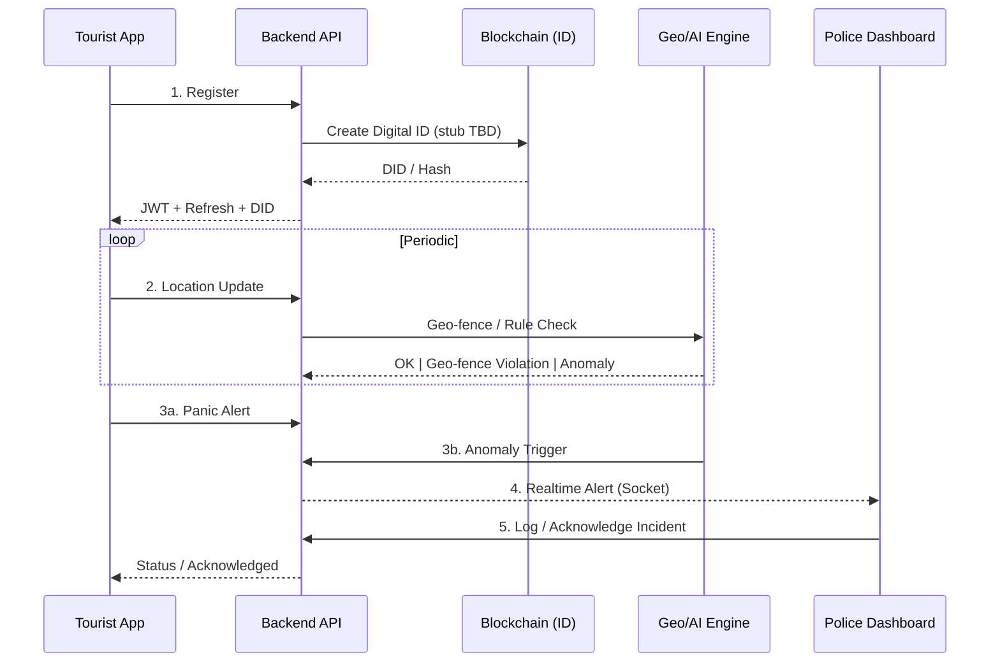

# ✅ Suraksha Yatra – MVP Tracking & Work Board

Keeping a living snapshot of what’s DONE, IN PROGRESS, and PENDING for the 6‑Day MVP + immediate extensions.

---
## 4.1 Use Case Diagram (MVP)

## 4.2 High-Level Data Flow

## 5. MVP Deliverables
- Tourist Mobile App (React Native / Expo)
- Backend APIs (Auth, Panic, Alerts) + Blockchain ID module (stub / later)
- Police/Tourism Dashboard (React / Vite)
- Rule-based AI anomaly detection service (initial heuristics)

---
## 📦 Feature Status (Legend: ✅ Done | 🟡 In Progress | ⏳ Pending | 🔜 Planned)

### Mobile App
- ✅ Expo scaffold & navigation
- ✅ Login screen (currently simple; real auth wired)
- ✅ Register + Login via backend (after recent changes)
- ✅ Panic alert creation → backend
- ✅ Map screen (current location marker)
- ✅ Auth tokens (access + refresh, auto refresh interceptor)
- ✅ Secure storage (token & refreshToken)
- 🟡 Role-aware UI (await roles usage)
- ⏳ Display alert acknowledgment state
- ⏳ Nearby alerts fetch (`/api/panic-alerts/near`)
- 🔜 Background location / periodic updates
- 🔜 Geo-fence local pre-check (optional optimization)

### Backend
- ✅ Express + TypeScript scaffolding
- ✅ MongoDB integration (Mongoose)
- ✅ Auth: register/login + bcrypt hashing
- ✅ JWT access + refresh tokens (rotation & blacklist via revoke)
- ✅ DID generation on register (hash-based stub)
- ✅ Panic alerts persistence
- ✅ Incident model + creation (panic + geofence/anomaly)
- ✅ Location updates endpoint (`/api/location`)
- ✅ Geospatial index + nearby query
- ✅ Acknowledge endpoint (role restricted)
- ✅ Role middleware (requireRole) (inline fallback in panic route – unify later)
- ✅ Basic OpenAPI generator script (swagger stub)
- 🟡 Serve OpenAPI JSON via route
- 🟡 Incident listing (basic) / pagination + advanced filtering pending
- 🟡 Basic anomaly/geofence heuristics (speed, accuracy, high‑risk zone) – rules engine pending
- 🟡 Blockchain DID module (on-chain integration later)

### Dashboard (NOT STARTED)
- ⏳ Vite + React scaffold
- ⏳ Auth (login + role-based access)
- ⏳ Realtime socket connection (panic feed)
- ⏳ Alerts table + acknowledgment action
- ⏳ Map with active alerts + clustering
- ⏳ Incident log view & filters

### AI / Rule Engine
- ✅ Basic heuristics (speed > threshold, low GPS accuracy, high‑risk geofence)
- ⏳ Define rule set (inactivity, speed drop, geo-fence exit)
- ⏳ Service endpoint `/api/anomaly/eval` (or internal module)
- 🔜 Hook into location updates pipeline (convert heuristics into pluggable rules)

### Blockchain Module
- ✅ DID generation stub (hash) integrated in registration
- 🔜 Replace stub with on-chain call (testnet)
- ⏳ Digital ID verification endpoint

### Security & Ops
- ✅ Helmet & rate limiting
- ✅ Secure refresh token storage (server DB, revoke capable)
- 🟡 Swagger improvements (schemas, responses)
- ⏳ Audit logging (panic & ack)
- ⏳ Deployment scripts (Docker / Compose)

### Documentation
- ✅ Rich README (architecture, sprint, roles)
- ✅ TODO board (this file)
- 🟡 Expanded OpenAPI spec
- ⏳ CONTRIBUTING.md
- ⏳ ADR records (Blockchain vs centralized ID, DB choice switch)

---
## 🎯 Immediate Next Sprint Goals (Suggested)
1. Dashboard scaffold + Panic feed (critical for demo).
2. Simple anomaly rule: if no movement > X min OR sudden jump distance.
3. DID stub endpoint returning deterministic hash (simulate blockchain write).
4. Mobile: show list of recent user’s alerts + their ack status.
5. Serve swagger JSON at `/api/docs/openapi.json` and add a lightweight UI (Redoc/SwaggerUI).

---
## ☑️ Detailed Task Checklist

### Backend Core
- [ ] Serve generated OpenAPI file via Express route
- [ ] Add `/api/alerts/:id` GET (single alert)
- [ ] Add pagination to `/api/panic-alerts` (cursor or page)
- [ ] Implement anomaly rules engine skeleton (replace inline heuristics)
- [ ] DID explicit endpoint (optional) `POST /api/did/create` (currently auto on register)
- [ ] Expose user role update route (admin only)
- [ ] Unify role guard (remove inline duplicate in panic route)
- [ ] Incident query: pagination + filtering by type/severity/user

### Dashboard
- [ ] Create Vite React app under `dashboard/`
- [ ] Auth pages (login/register optional)
- [ ] Socket listener for `panic_alert`
- [ ] Table/List: recent alerts (ack button)
- [ ] Map view with alert markers
- [ ] Filter: acknowledged vs open
- [ ] Incident detail drawer

### Mobile Enhancements
- [ ] Replace hardcoded Base URL with env-driven config (Expo extra)
- [ ] Nearby alerts fetch + display (Map overlays)
- [ ] Show acknowledgement status on Panic screen
- [ ] Add register screen (optional toggle on login screen)
- [ ] Background location update interval (configurable)

### AI / Rules
- [ ] Define baseline rule DSL (JSON config)
- [ ] Implement inactivity rule
- [ ] Implement geo-fence exit rule
- [ ] REST endpoint to test rule evaluation manually
- [ ] Emit anomaly as synthetic panic (flagged type) (currently separate incident only)

### Blockchain Stub
- [x] Add DID field to user model
- [x] DID generator util (hash of email + timestamp)
- [ ] Endpoint to retrieve DID & verification signature (placeholder)

### DevOps / Quality
- [ ] Dockerfile (backend)
- [ ] Docker Compose (backend + mongo)
- [ ] Seed script for demo users (admin/officer/tourist)
- [ ] Basic unit tests for auth and panic routes
- [ ] Lint / formatting config (ESLint + Prettier)

---
## 🔍 Traceability Matrix (Deliverable → Tasks)
| Deliverable | Key Tasks |
|-------------|----------|
| Mobile App | Navigation, Panic, Map, Auth, Nearby Alerts |
| Backend APIs | Auth, Panic, Geo, Refresh, Acknowledge, DID Stub |
| Dashboard | Realtime socket, Alerts table, Map, Ack UI |
| Anomaly Service | Rule engine, Inactivity rule, Geo-fence rule |
| Blockchain ID | DID create stub, store hash, verify endpoint |

---
## 📝 Notes
- Geo queries require MongoDB with `2dsphere` index (already defined).
- Refresh tokens stored server-side; rotation implemented (revoke on rotate pending usage).
- OpenAPI currently minimal: extend with schemas for each entity (User, PanicAlert, Auth responses).
- DID integration can stay a stub for MVP demo: emphasize pluggable architecture.

---
Last updated: 2025-09-15
