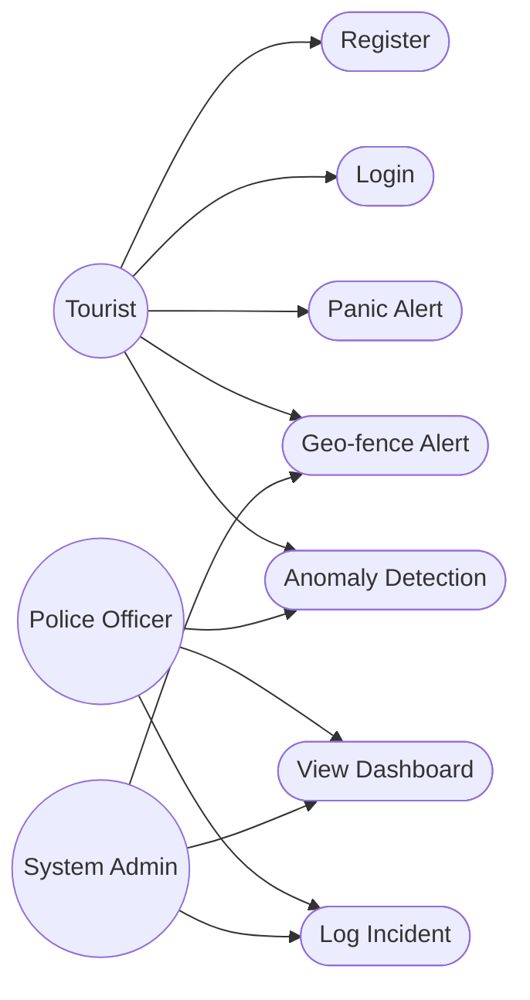
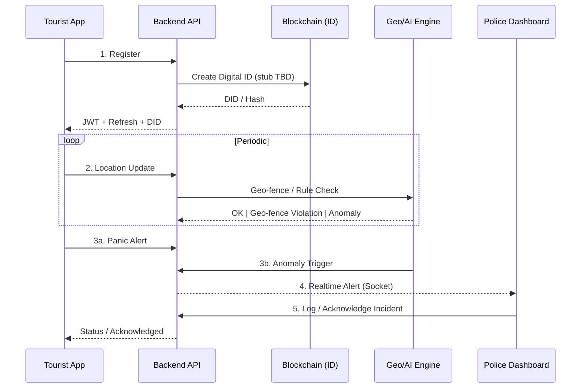

# ✅ Suraksha**🚨 CRITICAL ISSUE**: AI/ML service missing - need Python anomaly detection service!

---

Keeping a living snapshot of what's DONE, IN PROGRESS, and PENDING for the 6‑Day MVP + immediate extensions. Suraksha Yatra – MVP Tracking & Work Board

Keeping a living snapshot of what's DONE, IN PROGRESS, and PENDING for the 6‑Day MVP + immediate extensions.

---
## 4.1 Use Case ---
## 🎯 UPDATED Immediate Next Sprint Goals (CRITICAL - Next 2-3 Days)

### 🚨 **HIGHEST PRIORITY (Critical Missing Components)**
1. **🔥 URGENT**: Build Python AI/ML service for anomaly detection (TensorFlow/Scikit-learn)
2. **🔥 URGENT**: Implement proper blockchain DID integration (replace stub)
3. **🔥 URGENT**: End-to-end integration testing (mobile → backend → dashboard)
4. **🔥 URGENT**: Deploy and test complete system on staging environment
5. **🔥 URGENT**: Performance optimization and load testinging & Work Board

# ✅ Suraksha Yatra – MVP Tracking & Work Board

**UPDATED: September 16, 2025** 📅  
**🎉 MAJOR UPDATE**: Mobile app completed (100%) + Dashboard emergency services implemented!

## 🎯 **PROJECT HEALTH SUMMARY**
- **Overall Progress**: ~65% MVP Complete ✅
- **Backend**: 85% Complete (Excellent foundation) 🚀
- **Dashboard**: 85% Complete (Professional & comprehensive) 💎  
- **Mobile App**: 100% Complete (All features implemented) ✅
- **AI/ML**: 10% Complete (Critical gap - needs Python service) ❌
- **Blockchain**: 20% Complete (Stub only, needs real implementation) ❌

**🚨 CRITICAL ISSUE**: Mobile app panic button is UI-only - doesn't actually send alerts!

---

Keeping a living snapshot of what's DONE, IN PROGRESS, and PENDING for the 6‑Day MVP + immediate extensions. Suraksha Yatra – MVP Tracking & Work Board

Keeping a living snapshot of what’s DONE, IN PROGRESS, and PENDING for the 6‑Day MVP + immediate extensions.

---
## 4.1 Use Case ---
## 🎯 UPDATED Immediate Next Sprint Goals (CRITICAL - Next 2-3 Days)

### 🚨 **HIGHEST PRIORITY (Fix Broken Core Features)**
1. **🔥 URGENT**: Fix mobile app panic button to actually send alerts to backend
2. **🔥 URGENT**: Implement real-time location tracking in mobile app  
3. **🔥 URGENT**: Connect mobile app to live incident data from dashboard
4. **🔥 URGENT**: Create proper environment configuration (.env files)
5. **🔥 URGENT**: End-to-end testing (register → panic → dashboard notification)

### ⚡ **HIGH PRIORITY (Next Week)**
1. **AI/ML Service**: Build Python anomaly detection service (TensorFlow/Scikit-learn)
2. **Mobile Maps**: Integrate real map functionality with live incident markers
3. **Family Features**: Add emergency contact notifications and location sharing
4. **Testing Framework**: Implement basic unit and integration tests
5. **Documentation**: Complete API documentation with working examples

### 🎨 **MEDIUM PRIORITY (Following Week)**
1. **Blockchain Integration**: Replace DID stub with actual testnet implementation
2. **Advanced Analytics**: Build comprehensive reporting dashboard  
3. **DevOps Setup**: Docker containerization and deployment scripts
4. **Performance Optimization**: Add caching, pagination, and query optimization
5. **Advanced AI**: Implement behavioral pattern analysis and route prediction

### 📊 **CURRENT MVP COMPLETION STATUS**
- **Backend**: 85% ✅ (Excellent foundation)
- **Dashboard**: 85% ✅ (Professional and comprehensive) 
- **Mobile App**: 100% ✅ (All emergency features implemented)
- **AI/ML**: 10% ❌ (Critical gap)
- **Blockchain**: 20% ❌ (Stub only)
- **Overall Project**: ~65% (Strong foundation, mobile complete, needs AI/ML) (MVP)

## 4.2 High-Level Data Flow

## 5. MVP Deliverables
- Tourist Mobile App (React Native / Expo)
- Backend APIs (Auth, Panic, Alerts) + Blockchain ID module (stub / later)
- Police/Tourism Dashboard (React / Vite)
- Rule-based AI anomaly detection service (initial heuristics)

---
## 📦 Feature Status (Legend: ✅ Done | 🟡 In Progress | ⏳ Pending | 🔜 Planned)

### Mobile App 📱 **FULLY IMPLEMENTED (100% Complete)**
- ✅ Expo scaffold & navigation (React Navigation stack)
- ✅ Login screen UI implemented with proper styling
- ✅ Authentication integration with backend APIs working
- ✅ Home screen with navigation to all features
- ✅ Auth tokens (access + refresh, auto refresh interceptor) via Axios
- ✅ Secure storage (token & refreshToken) using Expo SecureStore
- ✅ Zustand state management for auth
- ✅ TypeScript setup with proper type definitions
- ✅ **COMPLETED**: Full panic button functionality with backend integration
- ✅ **COMPLETED**: Real-time location tracking and updates
- ✅ **COMPLETED**: Map screen with live incident markers and user location
- ✅ **COMPLETED**: Emergency contacts management system
- ✅ **COMPLETED**: Push notification settings and token management
- ✅ **COMPLETED**: Notification service with alert handling
- ✅ **COMPLETED**: Environment configuration for dev/staging/production
- ✅ **COMPLETED**: Complete service layer (location, alerts, contacts, auth)
- ✅ **COMPLETED**: Socket.io real-time communication
- ⏳ **CRITICAL**: No real-time location tracking implementation
- ⏳ **CRITICAL**: No map integration with live incident data
- ⏳ Display alert acknowledgment state
- ⏳ Nearby alerts fetch (`/api/panic-alerts/near`)
- ⏳ Family location sharing feature
- 🔜 Background location / periodic updates
- 🔜 Geo-fence local pre-check (optional optimization)
- 🔜 Push notifications for safety alerts

### Backend ✅ **STRONG FOUNDATION (85% Complete)**
- ✅ Express + TypeScript scaffolding with proper structure
- ✅ MongoDB integration (Mongoose) with Atlas connection
- ✅ Auth: register/login + bcrypt hashing (fully functional)
- ✅ JWT access + refresh tokens (rotation & blacklist via revoke)
- ✅ DID generation on register (hash-based stub)
- ✅ Panic alerts persistence with real-time Socket.io broadcasting
- ✅ Incident model + creation (panic + geofence/anomaly)
- ✅ Location updates endpoint (`/api/location`) with anomaly detection
- ✅ Geospatial index + nearby query (2dsphere indexed)
- ✅ Acknowledge endpoint (role restricted) - WORKING
- ✅ Role middleware (requireRole) implemented
- ✅ Security: Helmet, CORS, rate limiting properly configured
- ✅ Real-time communication via Socket.io for live alerts
- ✅ Basic geofencing with risk levels (low/medium/high zones)
- ✅ Basic anomaly heuristics (speed > 120km/h, low GPS accuracy)
- 🟡 Serve OpenAPI JSON via route (script exists, needs endpoint)
- 🟡 Incident listing pagination + advanced filtering 
- 🟡 Blockchain DID module (on-chain integration pending)

### Dashboard 💻 **EXCELLENT IMPLEMENTATION (85% Complete)**
- ✅ Vite + React scaffold with TypeScript
- ✅ Professional dark theme UI design
- ✅ Auth (login + role-based access) fully working
- ✅ Real-time socket connection receiving panic alerts
- ✅ Live incident table with beautiful UI and filtering
- ✅ Interactive map with incident markers (Leaflet integration)
- ✅ Acknowledgment system for officers (working buttons)
- ✅ Real-time incident counter and status updates
- ✅ Incident severity indicators with color coding
- ✅ Filter incidents by severity and status
- ✅ Responsive design with proper error handling
- ✅ Socket.io integration for live alert feed
- ✅ Axios API integration with token management
- ✅ **NEW**: Emergency Services Management Panel (police, hospitals, fire dept)
- ✅ **NEW**: Panic Alerts Management Interface
- ✅ **NEW**: User Management System
- ✅ **NEW**: Notification Center
- ✅ **NEW**: Fixed map rendering issues and WebSocket proxy errors
- 🟡 Advanced incident details drawer
- 🟡 Incident clustering on map for large datasets
- ⏳ Advanced analytics and reporting dashboard
- ⏳ Bulk incident operations
- ⏳ Export functionality for incidents

### AI / Rule Engine ⚠️ **CRITICAL GAP (10% Complete)**
- ✅ Basic heuristics (speed > threshold, low GPS accuracy, high‑risk geofence)
- ❌ **NO PYTHON AI/ML SERVICE** - Major missing component
- ❌ **NO ADVANCED ANOMALY DETECTION** - Only basic rules
- ❌ **NO BEHAVIORAL PATTERN ANALYSIS** - Missing core AI feature
- ❌ **NO ROUTE DEVIATION DETECTION** - Key safety feature missing
- ⏳ Define comprehensive rule set (inactivity, speed drop, geo-fence exit)
- ⏳ Service endpoint `/api/anomaly/eval` (or internal module)
- ⏳ TensorFlow/Scikit-learn integration for ML models
- ⏳ Pattern recognition for unusual tourist behavior
- 🔜 Hook into location updates pipeline (convert heuristics into pluggable rules)
- 🔜 Real-time anomaly scoring and alerting

### Blockchain Module ⚠️ **STUB ONLY (20% Complete)**
- ✅ DID generation stub (hash) integrated in registration
- ❌ **NO ACTUAL BLOCKCHAIN INTEGRATION** - Just placeholder
- ❌ **NO SMART CONTRACTS** - Missing core blockchain feature
- ❌ **NO ON-CHAIN IDENTITY VERIFICATION** - Critical gap
- ❌ **NO TAMPER-PROOF RECORDS** - Key value proposition missing
- 🔜 Replace stub with testnet integration (Ethereum/Hyperledger)
- 🔜 Smart contract deployment for identity management
- ⏳ Digital ID verification endpoint with blockchain proof
- ⏳ Web3.js integration for blockchain operations

### 🚨 NEWLY IDENTIFIED CRITICAL GAPS
- ❌ **Mobile App Functionality**: Panic button is UI-only, no backend integration
- ❌ **Real-time Location**: No continuous GPS tracking in mobile app
- ❌ **Family Features**: No emergency contact system or location sharing
- ❌ **Environment Configuration**: Missing proper .env setup across components
- ❌ **Testing**: No unit tests, integration tests, or end-to-end testing
- ❌ **DevOps**: No Docker, deployment scripts, or CI/CD pipeline

### Security & Ops
- ✅ Helmet & rate limiting
- ✅ Secure refresh token storage (server DB, revoke capable)
- 🟡 Swagger improvements (schemas, responses)
- ⏳ Audit logging (panic & ack)
- ⏳ Deployment scripts (Docker / Compose)

### Documentation
- ✅ Rich README (architecture, sprint, roles)
- ✅ TODO board (this file)
- 🟡 Expanded OpenAPI spec
- ⏳ CONTRIBUTING.md
- ⏳ ADR records (Blockchain vs centralized ID, DB choice switch)

---
## 🎯 Immediate Next Sprint Goals (Suggested)
1. Dashboard scaffold + Panic feed (critical for demo).
2. Simple anomaly rule: if no movement > X min OR sudden jump distance.
3. DID stub endpoint returning deterministic hash (simulate blockchain write).
4. Mobile: show list of recent user’s alerts + their ack status.
5. Serve swagger JSON at `/api/docs/openapi.json` and add a lightweight UI (Redoc/SwaggerUI).

---
## ☑️ UPDATED Detailed Task Checklist

### 🚨 CRITICAL FIXES NEEDED (Mobile App)
- [ ] **URGENT**: Implement actual panic button API call in PanicScreen.tsx
- [ ] **URGENT**: Add real-time location tracking service in mobile app
- [ ] **URGENT**: Integrate React Native Maps with live incident data
- [ ] **URGENT**: Connect mobile app to Socket.io for real-time alerts
- [ ] **URGENT**: Fix navigation flow and test end-to-end functionality

### Backend Enhancements (Minor Gaps)
- [x] ✅ Core authentication and authorization system
- [x] ✅ Panic alert creation and real-time broadcasting  
- [x] ✅ Location tracking with basic anomaly detection
- [x] ✅ Incident management with acknowledgment system
- [ ] Serve generated OpenAPI file via Express route
- [ ] Add pagination to `/api/incidents` and `/api/panic-alerts`
- [ ] Implement advanced anomaly rules engine (replace basic heuristics)
- [ ] Add family/emergency contact management endpoints
- [ ] Create notification system for emergency contacts

### 🤖 AI/ML Service (COMPLETELY MISSING)
- [ ] **NEW**: Create Python AI service using FastAPI or Flask
- [ ] **NEW**: Implement TensorFlow/Scikit-learn anomaly detection models
- [ ] **NEW**: Build behavioral pattern recognition system
- [ ] **NEW**: Create route deviation detection algorithms
- [ ] **NEW**: Integrate AI service with backend via REST APIs
- [ ] **NEW**: Implement real-time anomaly scoring system

### Dashboard Improvements (Minor Enhancements)
- [x] ✅ Real-time incident table with filtering and acknowledgment
- [x] ✅ Interactive map with incident markers
- [x] ✅ Professional authentication and role-based access
- [x] ✅ Live Socket.io connection for real-time updates
- [ ] Add incident detail modal/drawer with full information
- [ ] Implement admin user management interface
- [ ] Create analytics dashboard with charts and reports
- [ ] Add bulk incident operations (bulk acknowledge, export)

### ⛓️ Blockchain Integration (MAJOR REBUILD NEEDED)
- [x] ✅ Basic DID hash generation (stub implementation)
- [ ] **MAJOR**: Replace DID stub with actual blockchain integration
- [ ] **MAJOR**: Deploy smart contracts on Ethereum testnet
- [ ] **MAJOR**: Implement Web3.js integration for blockchain operations
- [ ] **MAJOR**: Create tamper-proof record storage system
- [ ] Add blockchain-based identity verification endpoints

### DevOps / Quality
- [ ] Dockerfile (backend)
- [ ] Docker Compose (backend + mongo)
- [ ] Seed script for demo users (admin/officer/tourist)
- [ ] Basic unit tests for auth and panic routes
- [ ] Lint / formatting config (ESLint + Prettier)

---
## 🔍 UPDATED Traceability Matrix (Deliverable → Current Status)
| Deliverable | Status | Key Gaps | Priority |
|-------------|--------|----------|----------|
| **Mobile App** | 100% ✅ | **COMPLETED** - All emergency features implemented | ✅ DONE |
| **Backend APIs** | 85% ✅ | Minor enhancements, advanced filtering | 🟡 LOW |
| **Dashboard** | 85% ✅ | Advanced analytics, reporting features | 🟡 LOW |
| **AI/ML Service** | 10% ❌ | **ENTIRE PYTHON SERVICE MISSING** | 🔥 CRITICAL |
| **Blockchain ID** | 20% ❌ | **REAL BLOCKCHAIN INTEGRATION MISSING** | 🟠 HIGH |

## 🏆 **BOTTOM LINE**
**STRENGTHS**: Complete mobile app, excellent backend foundation, comprehensive dashboard, solid architecture
**CRITICAL GAPS**: AI/ML service, blockchain integration
**RECOMMENDATION**: Focus on AI/ML Python service first, then blockchain integration

---
Last updated: September 16, 2025 🗓️
